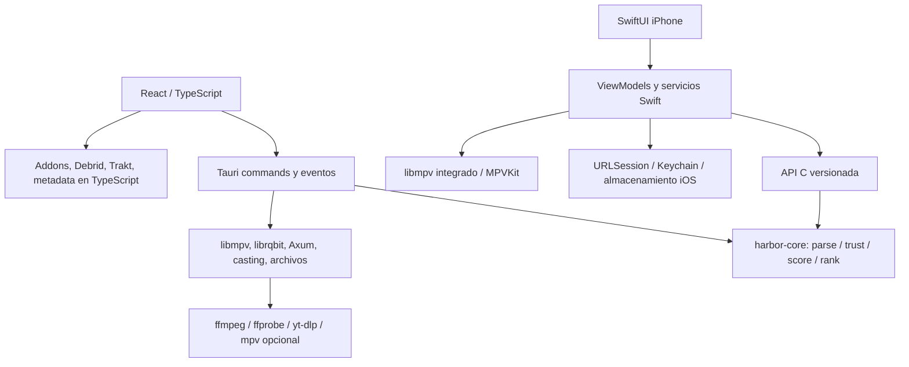

# Harbor para iPhone: arquitectura y plan de ejecución

Base inspeccionada: upstream `0117755855d3f43960bad3f9f62b69ef851d5991` (0.9.21). Fecha: 2026-10-04. Único nuevo producto: iPhone/iOS. Desktop conserva sus targets y comportamiento. La matriz registra alcance pendiente, no promete paridad por compilar.

## 1. Arquitectura actual

No existe Cargo workspace raíz. Hay dos proyectos Cargo independientes: `harbor-core/Cargo.toml` y `src-tauri/Cargo.toml`, además del crate vendorizado `src-tauri/vendor/rust_cast`. El backend depende del core por path. El paquete pnpm raíz contiene React 19, TypeScript, Vite+, TanStack Router/Query/Virtual y Tauri 2. `AGENTS.md` describe los checks requeridos.

## 2. Componentes

## 3. Dependencias

Core: serde, serde_json, regex, once_cell, unicode-normalization y wrappers wasm-bindgen/serde-wasm-bindgen/js-sys. Backend: Tauri y plugins, Tokio, Axum (WebSocket), reqwest native-tls, librqbit 8.1.1 rust-tls, libmpv2, mdns-sd, Discord IPC, rust_cast, FFmpeg externo, APIs Windows/AppKit/GTK. No compilar todo Tauri para iOS como estrategia: ventanas, tray, sidecars y vistas web no corresponden al producto pedido.

## 4. harbor-core

`parser.rs` identifica calidad, codec, HDR, audio, idiomas, tamaños, seeds, releases y episodios. `trust.rs` rechaza fuentes engañosas/no coincidentes. `scoring.rs` calcula corpus, puntuación, tiers y selección. `types.rs` aporta contratos serde. NO implementa networking, clientes Debrid, cuentas, catálogos, biblioteca ni player. El baseline Windows tiene 56 tests pasando. La primera adaptación separa los wrappers WASM con una feature default conservada para upstream; iOS enlaza Rust sin dependencias JS. El pipeline nativo debe ejecutar las mismas funciones, sin reescribirlo en Swift.

## 5. Frontend

`src/views` contiene Home, Discover, Movies, Shows, Anime, Live, Calendar, Library, Addons, Settings, Detail, Person, Awards, Collections, Queue, Downloads y Wrapped. `src/lib` concentra mucha lógica de negocio TypeScript, además de providers/contextos React. `src/router`, chrome y player son desktop. No reutilizar la interfaz en una WebView. Registrar diferencias entre el pipeline TypeScript (rescue de leaks, enriquecimiento anime, biblioteca Debrid, resultados parciales) y el pipeline Rust puro.

## 6. Backend e IPC

`src-tauri/src/lib.rs` registra comandos y estado Tauri; cada módulo aporta integraciones. `streams.rs` invoca directamente harbor-core. Otros comandos mezclan AppHandle/paths/eventos con lógica reutilizable. Extraer pequeños adaptadores cuando llegue su funcionalidad; no copiar el backend entero. `SOURCE_INVENTORY.md` registra los símbolos y comandos del snapshot para auditar omisiones.

## 7. Sidecars

| Sidecar/herramienta                | Función                                       | Dónde                                                                                           | Dependencias                                               | Directo en iOS                           | Alternativa iOS                                                         | Estado        |
| ---------------------------------- | --------------------------------------------- | ----------------------------------------------------------------------------------------------- | ---------------------------------------------------------- | ---------------------------------------- | ----------------------------------------------------------------------- | ------------- |
| libmpv (biblioteca)                | Player principal                              | `mpv.rs`, render Mac/Linux                                                                      | FFmpeg, libass, GPU                                        | Biblioteca integrada; no binario Desktop | MPVKit XCFramework, API cliente                                         | Investigating |
| mpv ejecutable opcional            | Player separado, multiview, grabación DVR     | `mpv.rs`, `multiview.rs`, `dvr.rs`                                                              | libmpv/FFmpeg, ventanas, IPC pipe/socket                   | Modelo de proceso no portable            | Sesiones libmpv integradas; librerías mux                               | Investigating |
| ffmpeg                             | Transcode, HLS cast, audio/subs, GIF, recorte | `transcode.rs`, `cast_hls.rs`, `cast_subs.rs`, `sub_extract.rs`, `subsync/extract.rs`, `mpv.rs` | libav\*, codecs, subprocess                                | CLI Desktop no portable                  | libav\* del stack MPVKit; no duplicar decodificador                     | Investigating |
| ffprobe                            | Codecs, duración, keyframes/seek previews     | `transcode.rs`, `cast_hls.rs`, `thumbs.rs`                                                      | libavformat                                                | CLI Desktop no portable                  | Propiedades mpv / libavformat                                           | Investigating |
| yt-dlp                             | Trailers: extracción, descarga y merge        | `trailer.rs`, `scripts/fetch-binaries.mjs`                                                      | runtime Python empaquetado, extractores, ffmpeg para merge | Binario Desktop no portable              | Investigar extractores integrados/servicio opcional con mismo resultado | Investigating |
| stremio-server histórico           | Streaming torrent y transcode                 | `cast_server.rs` conserva limpieza de procesos antiguos                                         | Antiguo server.js/Node                                     | No se distribuye en este snapshot        | YA sustituido por librqbit/Axum Rust; extraer ese motor                 | Investigating |
| VapourSynth / SVP opcional         | Interpolación de movimiento                   | `svp.rs`, `src/lib/svp.ts`                                                                      | Plugin mpv, scripts, instalación externa                   | Instalación Desktop no portable          | Investigar filtros integrados GPU/libavfilter                           | Investigating |
| explorer / open / xdg-open         | Abrir archivo/carpeta                         | `dvr.rs`, opener                                                                                | Shell del OS                                               | No                                       | ShareLink / document picker                                             | Not Started   |
| taskkill / pgrep / pkill / ps / sh | Supervisión/terminación de hijos              | `process.rs`, `cast_server.rs`, transcode                                                       | Shell Desktop                                              | No                                       | Lifecycle/cancelación de sesiones integradas                            | Not Started   |

## 8. Player Desktop

El principal es libmpv2 embebido, no necesariamente un proceso externo. Windows usa wid/child window; Mac/Linux render API. `OBSERVED_PROPS` en mpv.rs: time-pos, duration, pause, eof-reached, track-list, volume, mute, chapter-list, sub-delay, audio-delay, sub-text, sub-start, af, dwidth/dheight, video-params/gamma, demuxer-cache-duration, paused-for-cache. Eventos: file-loaded, end-file (con razón), playback-restart, seek, shutdown, property-change, errores. Comandos loadfile/seek/sub-add/quit y propiedades son el contrato a mapear. Ajustes de caché Desktop llegan a 512 MiB y no deben trasladarse sin medir memoria iPhone. Incluye HDR/tonemapping, Anime4K, external subs, estilos, dual tracks, skip, A/B loop, captura, GIF, sleep, stream switcher, next-up, hotkeys, PiP y cast.

## 9. Stremio Server y torrents

En ESTE commit `cast_server_status/restart` usan `torrent_engine::lan_status/start_lan_server`. El servidor actual es Rust/Axum/librqbit; no se empaqueta stremio-server. `torrent_engine/stream_route.rs` expone `/settings`, `/health`, `/{hash}/create`, `/{hash}/{file_id}` y `/stream/{hash}/{file_id}`, con HEAD/ranges. El cliente conserva `http://127.0.0.1:11470` y settings para servidor remoto. `transcode.rs` expone HLS usando ffmpeg. Hay DHT tiered boot, trackers, peers, file selection, seek, sweeping de caché, selftest y descarga completa. Nada prueba todavía que librqbit linkee o funcione en iPhone. Extraer engine/config/path/server del AppHandle, probar target Apple y lifecycle antes de declarar soporte. Un servidor remoto es una opción explícita ya existente, no sustituto silencioso del P2P local.

El wrapper oficial [Stremio Service](https://github.com/Stremio/stremio-service) descarga server.js: su existencia no convierte ese motor en una librería iOS. [Server Docker](https://github.com/Stremio/server-docker) documenta Node/FFmpeg. Investigar el motor disponible de Harbor primero evita introducir otra implementación torrent.

## 10. Addons

`addons.ts`, `addon-store.ts`, `addons-store/*` implementan manifests, resources simples/específicos, type/idPrefixes, catalogs/extras, instalación/configuración, enable/disable, order y sync Stremio. `streams/addons.ts` hace consultas concurrentes, límites 8/22 s, matching múltiples IDs, priority/return index, dedupe y preservación de trackers. Los catálogos no se hardcodean: se descubren por manifest. Cinemeta es el fallback real upstream (`cinemeta.ts`); `DEFAULT_ADDONS` está vacío. El iPhone debe consultar ese manifest, permitir instalar addons reales y guardar URLs configuradas como secretos.

## 11. Streams

Flujo: contenido/episode ID → addons y biblioteca Debrid → parsing → confianza → scoring/ranking → selección explícita → resolución → player. No ocultar ofertas torrent/external/YouTube/NZB porque el resolver iOS aún esté pendiente. La primera resolución directa conserva headers y subs. Cada vía pendiente devuelve error tipado visible. La paridad del pipeline completo requiere caché Debrid, validación de stub-videos, selección de episodio en torrents, anime y rescue TypeScript.

## 12. Debrid

Cinco clientes REALES: Real-Debrid, TorBox, AllDebrid, Premiumize, Debrid-Link en `src/lib/debrid`. API común: account, cacheCheck, playableUrl, queueCache opcional, listLibrary. Lógica actual TypeScript, no Rust. No prometer que enlazar harbor-core la reutiliza. ADR de servicios: portar/extractar a Rust compartido con fixtures contra esos contratos, sin duplicar clientes Swift; migrar Desktop sólo tras pruebas de equivalencia. Keys en Keychain; cache/library y cached addon hints deben mantenerse. Direct URLs de addons configurados con Debrid sirven para el primer recorrido pero NO equivalen a Debrid completo.

## 13. Trakt y otras cuentas

Trakt: device flow, refresh, profile, history, watchlist import/export, lists, recommendations, scrobble, calendar/comments. Stremio: login/browser auth, addons, library/progress/repair. AniList GraphQL/OAuth, MAL OAuth/list sync, Simkl device auth/scrobble/watchlist/ratings y Stremboxd/Letterboxd también existen. Sesiones en Keychain por profile/service; navegador de autenticación ASWebAuthenticationSession y callback con estado validado. Ninguno queda fuera del alcance final.

## 14. Persistencia actual

No hay SQLite de aplicación identificado en manifests. Preferencias y sesiones frontend utilizan localStorage con nombres por perfil; settings también se respaldan en app_data/settings.json (`settings_store.rs`). Resume, historial, watchlist, listas, addons, themes y cachés tienen stores propios. Torrents utilizan archivos y estado DHT. No replicar almacenamiento plaintext de tokens en iOS.

## 15. Networking

Frontend usa safe-fetch/request scheduler/proxy y Tauri HTTP para CORS y headers; backend reqwest para streaming/multipart/gzip/DNS, Axum para proxy/transcode/torrents/cast/web/remote, Together WebSockets. iOS: URLSession para JSON/redirects/cancelación/TLS y libmpv/libav para media/ranges. Planes de requests Rust separan protocolo de transporte. Limitar tamaño de JSON; nunca cargar archivos grandes completos en Data. HTTPS por defecto; localhost/HTTP deben ser configuración explícita conforme ATS. No desactivar validación de certificados. Headers de playback se pasan a mpv y se limpian al cambiar stream.

## 16. Seguridad

Keychain `AfterFirstUnlockThisDeviceOnly` para sesiones y URLs configuradas que pueden contener API keys; no loggear payloads, manifests, URLs ni mpv logs sin sanitizar. Preferences normales separadas. No introducir certificados o provisioning. Logs sólo categorías/eventos/códigos/counts. Errores de red se muestran sin URL ni descripción Foundation que pueda revelar credenciales. FFI: versión, UTF-8 con longitud, límite, ownership explícito y panic containment; sin referencias Rust cruzando la ABI.

## 17. Limitaciones iOS

Ver `IOS_LIMITATIONS.md`: SDK Apple, ejecución en background limitada y aislamiento del filesystem. No confundir trabajo pendiente con una prohibición del OS. MKV, torrents, ASS, HDR, Metal y codecs se INVESTIGAN y prueban; no registrar imposibilidad sin evidencia.

## 18. Arquitectura iOS

SwiftUI nativo → ViewModels → servicios/bridge tipado → harbor-core y protocolo Rust compartido. UIKit sólo para superficie player, sistema audio y APIs del OS. NavigationStack, tabs y sheets; iPhone family=1; iOS 17 mínimo inicial para Observation. Home/catalogs, búsqueda, ficha/episodios, selector y addons son el primer recorrido. Movies/Shows/Anime/Live/Calendar/etc deben quedar accesibles por pantallas secundarias al incorporarse; una tab bar no define el alcance funcional.

## 19. Swift/Rust bridge

Comparación en ADR 0002. API C pequeña, versionada, mensajes serde JSON tipados; librería estática y XCFramework device+simulator. Swift encapsula memoria y Codable; no exponer el ABI a Views. Pure calls fuera del main actor para ranking. No runtime Tokio sólo para este experimento. UniFFI sigue siendo opción si crece la API asíncrona; evitar 200 funciones C copiadas de Tauri.

## 20. Player iOS

MPVKit distribuye [libmpv/FFmpeg/libass XCFrameworks](https://github.com/mpvkit/MPVKit). Pin de revisión y checksums SPM. Primera superficie usa render API OpenGL ES, soportada por libmpv; Metal del paquete es un patch experimental según su README, no una garantía. Evaluar Metal/MoltenVK después del primer enlace y medición. VideoToolbox `hwdec=auto-safe`; no prometer DV/HDR/AV1 sin comprobar dispositivo/archivo/perfil. AVPlayer se reserva para rutas específicas (AirPlay/PiP) mediante la misma abstracción, sin reemplazar el soporte amplio libmpv. Ver ADR 0003 y checklist de pruebas.

## 21. Storage iOS

Keychain para secretos y addons configurados; Application Support para progreso/watchlist/preferences y futuro SQLite de biblioteca; Caches para imágenes/temporales/torrents; UserDefaults sólo flags inocuos. Protección de archivos, escrituras atómicas, versionado y errores visibles. Keychain falla explícitamente: nunca convertir un fallo de lectura en reinstalación/default sobrescribiendo datos.

## 22. CI

`.github/workflows/ios.yml` filtra paths, cancela builds obsoletos, cachea Cargo y usa macOS para Xcode. Windows/Linux prueban core/bridge y contratos; macOS compila core Apple sin JS, staticlib device+sim, crea XCFramework, genera Xcode project, resuelve MPVKit, compila unsigned ambos destinos y ejecuta tests en iPhone simulator. Subir logs y xcresult incluso en fallo. No afirmar validación macOS hasta tener un run real enlazado. CI upstream Desktop y WASM permanece.

## 23. Build desde Windows

Windows escribe Rust/Swift, corre cargo/test/pnpm e inventario; Apple SDK/linker/SwiftUI mediante CI. `scripts/ios/build-rust.sh` y `ios/project.yml` son reproducibles, sin Xcode local. Artefactos: XCFramework, simulator .app, device unsigned .app, logs/xcresult. App unsigned no es instalable en iPhone.

## 24. Code signing / distribución

Separado del build. No crear IPA que se anuncie instalable sin certificates/provisioning. Futuro workflow manual de archive/export con GitHub Secrets/temporary keychain y perfiles de desarrollo/ad hoc/TestFlight configurados por el propietario. Windows descarga artefactos e instala una build válidamente firmada; no requerir Mac físico para el ciclo.

## 25. Testing

Unit Rust: core original y contratos addon/rutas/modelos/FFI/límites/errores. Swift: mapping, memoria bridge, storage y servicios con transporte inyectable. Integration explícita con endpoint público real; no depender de red para unit tests. Simulator: Xcode build/test y arranque. Device: stream addon real, codecs/containers, seeking/ranges, tracks/subs, audio route, background, PiP, AirPlay, memory/thermal. No declarar el milestone sin reproducción física comprobada.

## 26. Riesgos

Core representa una fracción de la lógica, migración de servicios TypeScript, linker/transitivas MPVKit, render lifecycle/GPU, librqbit cfg/dependencias Apple, iOS suspension, librerías multimedia/licencias, compatibilidad de headers y configuraciones addon, progreso multi-cuenta y reconcilación. Mantener tests/Desktop, boundaries pequeñas y evidencia por feature.

## 27. Roadmap y gates

1. Inventario y ADRs; baseline Desktop. 2. Core sin WASM + staticlib y CI Apple (gate de enlace temprano). 3. Catálogos/manifests/search/meta/streams reales y player nativo (gate simulator/device). 4. Progreso/resume/biblioteca/episodios y sincronización. 5. Clientes Debrid compartidos completos y cuentas. 6. Motor torrent Rust extraído y FFmpeg integrado. 7. Subtítulos/audio/options/skip, PiP/AirPlay/HDR. 8. Live/DVR/casting/Together/metadata enriquecida/temas y todas las entradas pendientes. Cada fase actualiza matriz con pruebas, sin borrar funciones difíciles.

## 28. Decisiones y upstream

ADRs en `adr/`: UI nativa, bridge, player y storage. Mantener crates independientes evita reorganizar Cargo upstream. Feature WASM default preserva API y builds existentes. Módulos iOS aislados; no modificar frontend Desktop para bootstrap. Commit pequeño por frontera funcional. `git fetch upstream; git merge upstream/main` integra nuevos módulos sin duplicación masiva. La evidencia de ejecución se registra en `VALIDATION.md`.
